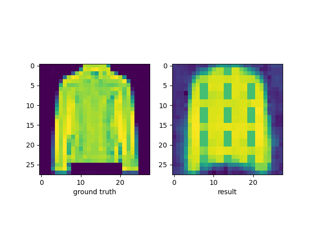

# Implementation of CNN AutoEncoder
## The goal of this project is to train a CNN autoencoder such that 
## it is able to reconstruct the input image.

### Dataset: FashionMNIST

### Installation:
    
    1. Run "pip3 install -r 'requirements.txt'"

### How to run

    1. Run "python autoencoder.py"

## Result
